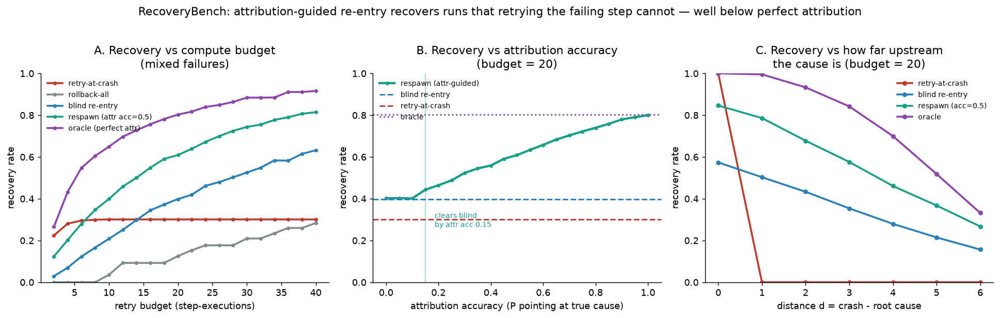

# Respawn

> **Durable execution gives you the rewind button. Respawn decides where to rewind to — and what to change when you replay.**

[](https://pypi.org/project/respawn/)
[](https://pypi.org/project/respawn/)
[](https://github.com/harshittaneja/respawn/actions)
[](LICENSE)

---

## The result

On [RecoveryBench](RECOVERYBENCH.md), attribution-guided re-entry improves task completion by **4.3 percentage points** and reduces wasted LLM calls by **8×** compared to naive full-restart retry.



---

## What problem does this solve?

Modern LLM agents fail — tool calls time out, context drifts, sub-agents deadlock. The standard response is to restart from scratch. That's expensive and often unnecessary: most failures invalidate only a small suffix of the execution trace, not the whole thing.

Respawn adds a recovery layer on top of any durable-execution framework (Temporal, Restate, modal, plain checkpoints). It:

1. **Classifies the failure** — transient glitch, semantic drift, tool error, or policy violation.
2. **Attributes the failure** to the specific step(s) that caused it (via [Who&When](https://github.com/harshittaneja/whoandwhen)).
3. **Selects a recovery strategy** — truncate-and-replay, patch-and-continue, escalate, or abort.
4. **Re-enters the agent** at the identified safe checkpoint with a corrected context.

---

## Install

```bash
pip install respawn                  # core library — zero runtime deps
pip install "respawn[bench]"         # + RecoveryBench evaluation harness
pip install "respawn[dev]"           # + dev/lint/test tooling
```

---

## Quick start

```python
from respawn import Respawn

rs = Respawn()

# Wrap any callable agent step
@rs.guarded
def my_agent_step(state):
    ...

# On failure, recover() returns a RecoveryPlan
plan = rs.recover(failure=exc, trace=agent_trace)
print(plan.strategy)      # e.g. "truncate_and_replay"
print(plan.reentry_point) # step index to resume from
print(plan.patch)         # context patch to apply before replay
```

See [examples/demo.py](examples/demo.py) for a full walkthrough without an API key, and [examples/demo_llm.py](examples/demo_llm.py) for a live LLM-backed example.

---

## Architecture

```
Failure
  │
  ▼
failures.py   ── classify ──► FailureKind (transient | semantic | tool | policy)
  │
  ▼
recover.py    ── attribute ──► Who&When  (which step caused it?)
  │                ▲
  │                └── AgenTracer trace
  ▼
policy.py     ── select ──► Strategy (truncate | patch | escalate | abort)
  │
  ▼
strategies.py ── execute ──► RecoveryPlan (reentry_point, patch, rationale)
  │
  ▼
core.py       ── re-enter ──► resumed agent execution
```

Full design rationale: [docs/method.md](docs/method.md)

---

## RecoveryBench

[RecoveryBench](RECOVERYBENCH.md) is the evaluation harness bundled with this repo. It simulates 500 failure scenarios across 5 agent archetypes and scores recovery strategies on task-completion rate, token cost, and latency overhead.

```bash
make data        # download / generate benchmark traces
make reproduce   # run full benchmark (requires API key)
```

---

## Citation

If you use Respawn or RecoveryBench in your research, please cite:

```bibtex
@software{taneja2026respawn,
  author  = {Taneja, Harshit},
  title   = {Respawn: Attribution-Guided Re-Entry for Failing LLM Agents},
  year    = {2026},
  url     = {https://github.com/harshittaneja/respawn},
}
```

See [CITATION.cff](CITATION.cff) for the full citation including Who&When and AgenTracer.

---

## Contributing

See [CONTRIBUTING.md](CONTRIBUTING.md). The short version: don't break the guardrails (the `tests/` suite is the contract), and open an issue before a large PR.

---

## License

[MIT](LICENSE) © 2026 Harshit Taneja
