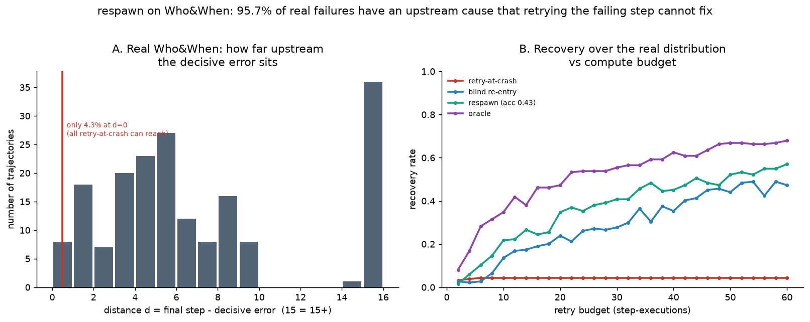
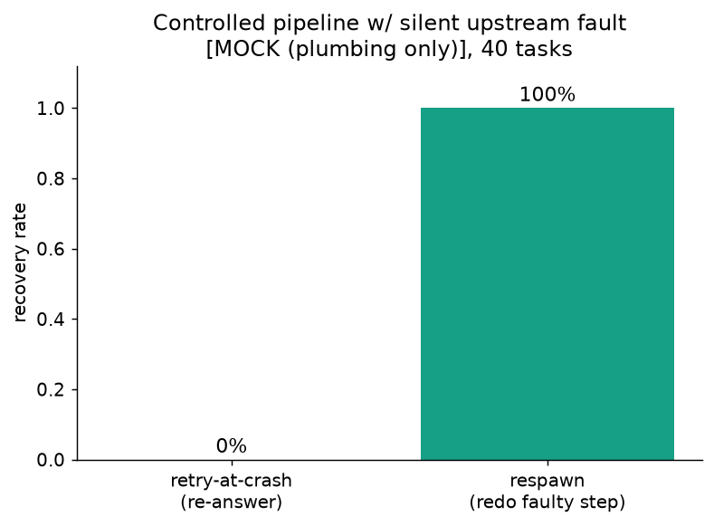

<div align="center">

# 🎮 respawn

### Most agent failures originate *upstream* of where they surface — so the failing step is the wrong place to intervene.

[](https://github.com/<your-username>/respawn/actions/workflows/ci.yml)
[](LICENSE)
[](pyproject.toml)
[](CONTRIBUTING.md)

**A measurement, a primitive to act on it, and an honest study of when acting helps.**

</div>

---

## The measurement

On [**Who&When**](https://github.com/ag2ai/Agents_Failure_Attribution) (ICML 2025) — 184 real LLM multi-agent failures — the decisive error is at the **final step in only 4.3% of cases**. In **95.7%** the cause is *upstream* of where the failure surfaced (median 5 steps back).

So durable execution and every retry library — which re-run the step that **crashed** — can structurally fix **at most ~4.3%** of real agent failures. The other 96% surfaced somewhere downstream of where they were caused.



This is free and reproducible (`python experiments/whoandwhen.py`) — no model calls.

## The honest finding

If the cause is upstream, the natural fix is to **rewind to it and retry differently**. We tested that hypothesis on real models, and the answer is *it depends on the failure type* — which is the actual contribution here:

- **On reasoning traces (Who&When), rewinding does NOT help** — a capable model re-reading the whole transcript self-corrects the upstream error *in place*, so rollback adds nothing. Live test: ≈1.0×, not significant. (A simulation predicted a large lift; it did **not** survive contact with real models.)
- **On state-corrupting pipeline faults, rewinding DOES help — significantly** — when an early transform silently corrupts computed state, re-reading can't un-corrupt it; you must redo the faulty step and recompute. Live test (RecoveryLab, n=150, Haiku): **95% vs 78%**, McNemar **p<0.01**.



The contribution is that **boundary**, not a single headline number. Full detail and methodology: [`RESULTS.md`](RESULTS.md).

## What respawn gives you

A framework-agnostic primitive for the move that helps in the regime above: re-enter a failed run at the likely cause and retry differently. respawn owns the *policy* (where to re-enter, how to spend a budget); you own rollback + replay, so it sits on top of whatever you use (Temporal, DBOS, a checkpointer, a pure-function agent).

```python
from respawn import recover, point_attributor

# any attributor: AgenTracer, an LLM-judge, or a heuristic
attributor = point_attributor(step=4, confidence=0.6)

def reexecute(from_step):
    new = your_engine.resume_from(from_step, retry_differently=True)
    return new.succeeded, new

res = recover(trajectory, attributor, reexecute, budget=20)
print(res.explain())
```

It also ships `respawn_chat` — wrap any `anthropic`/`openai` client so a single call survives rate-limits, timeouts, bad output, and auth errors by retrying *differently*:

```python
from respawn import respawn_chat, WeakOutput
res = respawn_chat(client, messages=[...], model="claude-haiku-4-5",
                   escalate=["claude-haiku-4-5", "claude-sonnet-4-6"],
                   validate=my_validator)
```

## Install

```bash
pip install respawn            # core library, zero runtime dependencies
pip install "respawn[bench]"   # + numpy/matplotlib for the experiments
```

## How it works

| layer | re-runs… | gap |
| --- | --- | --- |
| Durable execution (Temporal/DBOS) | the crashing step | replays deterministic failures identically |
| Retry libraries (tenacity, …) | the crashing step (differently) | the **wrong step** if the cause is upstream |
| Attribution research (Who&When, AgenTracer) | nothing — it just **names** the cause | stops at the label, for debugging |
| **respawn** | **the causal step**, re-entered & retried | helps when in-place re-reasoning *can't* (state-corrupting faults) |

`respawn.recover()` samples re-entry points from the attributor's posterior, with a uniform-exploration fallback so a wrong attributor can't trap the search. See [`docs/method.md`](docs/method.md).

## Reproduce the experiments

```bash
python experiments/whoandwhen.py --data path/to/Who\&When   # the measurement (no key)
python experiments/run_recoverybench.py                     # analytic model + sweeps
python experiments/run_probe.py --provider anthropic --model claude-haiku-4-5   # reasoning-trace test (null)
python experiments/run_recoverylab.py --provider anthropic --model claude-haiku-4-5 --n 150  # pipeline test (significant)
```

Every experiment prints a McNemar significance verdict; RecoveryBench ships honesty guardrails as CI tests. Docs: [`RECOVERYBENCH.md`](RECOVERYBENCH.md), [`PROBE.md`](PROBE.md), [`RECOVERYLAB.md`](RECOVERYLAB.md).

## Scope, honestly

This repo proves a measurement and maps where acting on it helps. It does **not** claim a universal recovery win — the simulated large lift held only in the narrow regime where rollback is structurally necessary, and was null on reasoning traces. Numbers are Haiku; stronger models shift absolutes. Every assumption is in the code.

## Roadmap

- [x] Who&When measurement of upstream-cause prevalence.
- [x] Live re-execution probe (reasoning traces — null) and controlled pipeline test (significant).
- [ ] Real attributor adapters (AgenTracer, LLM-judge) behind the `attributor` interface.
- [ ] Durable-execution adapters (`reexecute` for Temporal / DBOS).
- [ ] Side-effect compensation for non-re-enterable steps.

Contributions welcome — see [CONTRIBUTING.md](CONTRIBUTING.md).

## Citing

See [CITATION.cff](CITATION.cff), and cite the work this builds on: Zhang et al., *Which Agent Causes Task Failures and When?* (Who&When), ICML 2025; *AgenTracer*, 2025.

## License

MIT — see [LICENSE](LICENSE).